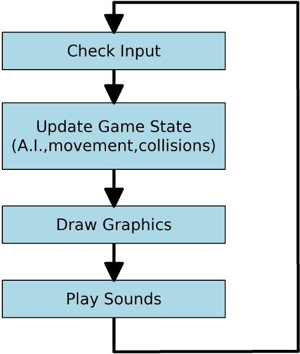

# Gaming?
<aside class="notes">
  HTML5 gives us a bunch of lego pieces to connect together and build really cool things.
</aside>

--
## Game Loop

<aside class="notes">
  window.requestAnimationFrame(). 60 times/second
</aside>

--

# Keyboard
```javascript
if(im.keyActions[keys.LEFT_ARROW].isPressed()){
	//move the player to the left
}

```
--

# Mouse / Touch
```javascript
//mobile first :)
var position = im.touchAction.position || im.mouseAction.position;
```

--

# Here comes the Hammer


--

# Gestures
```javascript
//hamer code
```
[Demo](demos/hammer/index.html)

--
# Gamepads
```javascript
navigator.webkitGetGamepads();
```
--
# Gamepad Polling

## Just check the gamepad state.
[Demo](http://www.html5rocks.com/en/tutorials/doodles/gamepad/gamepad-tester/tester.html)