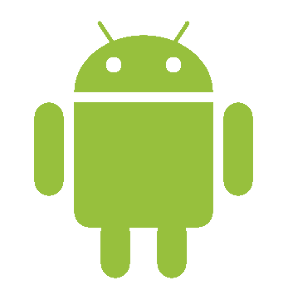
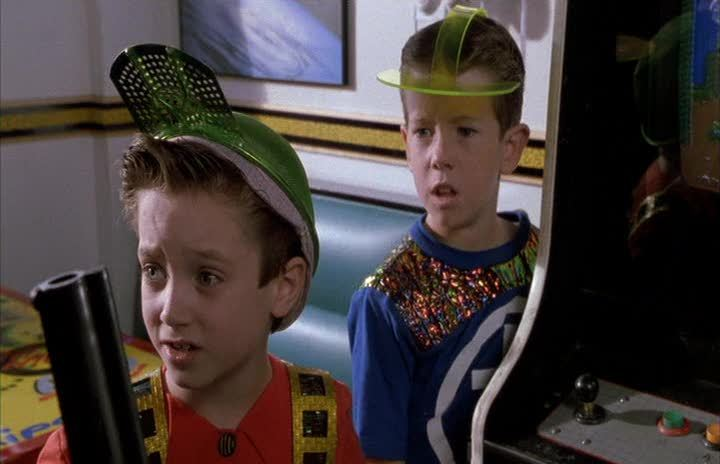
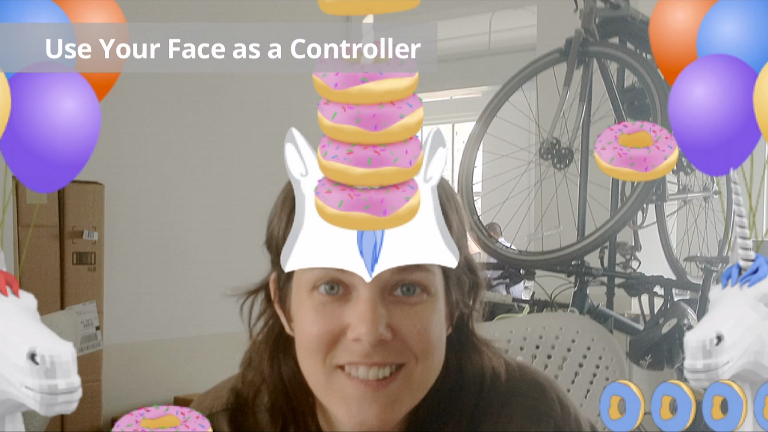
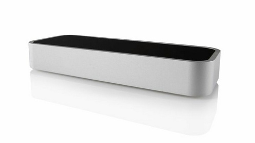
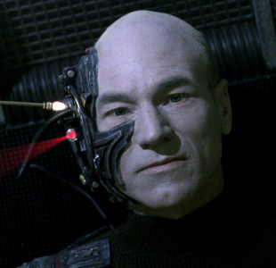
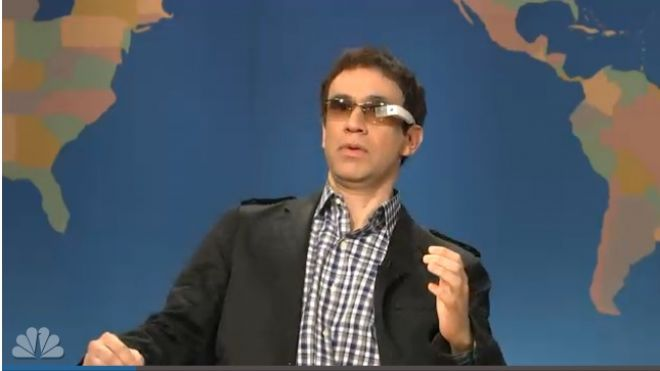
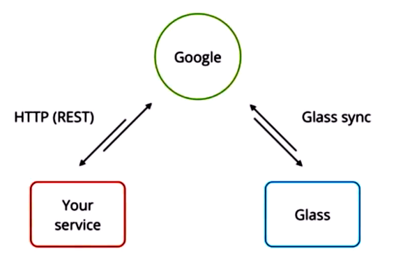
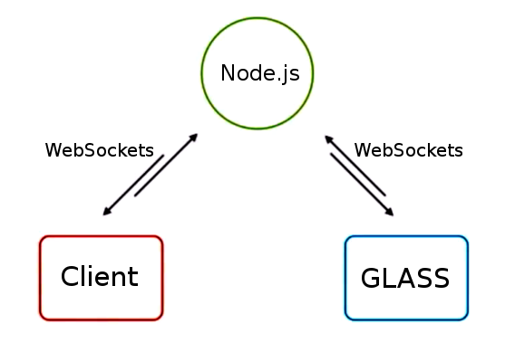

# Post-Modern

--
# Phone as a Gamepad
 
## There's an app for that...


--
# It's called a Browser
 

[demo](http://azprogrammer.com/frozen/vanagon)
--

## You have to use your hands?

## That's like a baby's toy.
--

# Camera Face Tracking

<aside class="notes">
  Donut Horns made by B-Reel for Google hangouts
</aside>
--

# Voice Recognition


--

# Web Speech API
```javascript
//hamer code
```
[Demo](demos/voicecat/index.html)

--
# 3D Tracking
  
* Leap Motion
* MS Kinect
--
# Leap Motion

# WebSockets !
<aside class="notes">
  bindings for Java, CSharp, python...
</aside>
--
## leap.js
```javascript
//leap example
```
[Demo](demos/leapmotion/index.html)

--
## But I want to wear a controller...
 

--
# Project Glass


--
# Mirror API


--
# Face

[https://github.com/monteslu/Face](https://github.com/monteslu/Face)
--
## Face API


[demo](http://hackphx.com:11097/three/examples/face.html)
--
# Connect ALL the things.

# Websockets are your glue.
--

# Thank You

[@MONTESLU](http://twitter.com/monteslu)
